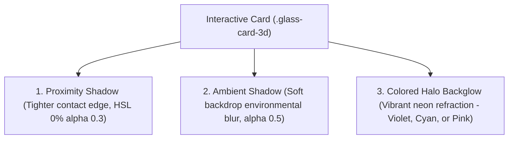

# 🌌 Aether AI — Next-Gen Celestial Modernism SaaS

```
     ___         ___  _________  ___  ___  _______   ________      ________  ___     
    /   \       /  / /   ______/|  /  /  /|   ____\ |   __   \    /   __   \|  |    
   /  _  \     /  /  |  |______ |  /__/  /|  |___   |  |__|  /   /   /  \   \  |    
  /  /_/  \   /  /   |   _____/ |   __  / |   ___\  |   _   \   /   /___/   /  |    
 /  /___/  \ /  /___ |  |______ |  /  /  \|  |____  |  | \   \  \   ______  /|  |___ 
/__/     /__/______/ \________/|__/  /__/ \_______/ \__/  \__\  \________/ |______/ 
```

Aether AI is an ultra-premium, production-grade Next.js 16 SaaS landing page designed with custom **Celestial Modernism** aesthetics. Engineered with performance-first architectures, this page features tactile three-dimensional layout cards, custom triple-layered ambient shadow stacks, high-performance GreenSock (GSAP) MatchMedia staggers, and a snappy native app-like mobile UX.

---

## 🎨 Visual System & Core Token Specifications

Aether AI operates on a custom-designed **Celestial Modernism Dark Theme** mapped using dynamic HSL variables for perfect contrast harmony:

```
┌────────────────────────────────────────────────────────┐
│  🌌 CELESTIAL BACKGROUND HSL(224, 71%, 4%)             │
│                                                        │
│  🟣 PRIMARY PURPLE        HSL(244, 100%, 88%)          │
│  🔵 SECONDARY CYAN        HSL(201, 100%, 78%)          │
│  🌸 TERTIARY VIOLET/PINK   HSL(274, 100%, 86%)          │
└────────────────────────────────────────────────────────┘
```

### 💎 The 3-Shadow Contact Stack (Proximity, Ambient, Colored Backglow)
Rather than standard flat box-shadows, Aether AI cards sit on a **triple-layered shadow offset system** designed to mimic realistic focal planes on dark glass canvases:



#### CSS Implementation Detail ([globals.css](src/app/globals.css)):
```css
.glass-card-3d {
  background: rgba(14, 19, 35, 0.4);
  backdrop-filter: blur(24px);
  border: 1px solid rgba(255, 255, 255, 0.08);
  border-bottom: 2px solid rgba(255, 255, 255, 0.14); /* 3D bottom bevel */
  border-right: 1.5px solid rgba(255, 255, 255, 0.09); /* 3D side bevel */
  
  box-shadow: 
    0 4px 10px rgba(0, 0, 0, 0.3),                 /* Shadow 1: Proximity */
    0 20px 40px -5px rgba(0, 0, 0, 0.5),           /* Shadow 2: Ambient */
    0 12px 24px -8px rgba(196, 192, 255, 0.08);    /* Shadow 3: Colored Glow */
}
```

---

## ⚡ GreenSock (GSAP) matchMedia Animation Pipeline

Animations are fully delegated to GreenSock's performant render pipeline, featuring scoped initialization contexts and **matchMedia viewports** to isolate desktop motion from mobile views:

*   **Zero Mobile Jank**: GreenSock animations (`ScrollTrigger`, timeline staggers, and elastic rotations) are mapped exclusively to `(min-width: 1024px)`.
*   **Instant Load on Handhelds**: On mobile and tablet screens, the animation timelines are completely bypassed, resulting in **instant layout rendering** without visual lag, rendering delays, or page loading white flashes.
*   **Automatic Garbage Collection**: Unmount lifecycle triggers call `mm.revert()` to guarantee zero memory leaks or stray animation threads.

#### GSAP Responsive Sequence Scaffolding:
```typescript
useEffect(() => {
  gsap.registerPlugin(ScrollTrigger);
  const mm = gsap.matchMedia();

  mm.add("(min-width: 1024px)", () => {
    // Elegant ScrollTrigger timelines and staggers execute here...
  });

  return () => mm.revert(); // Automatic cleanup
}, []);
```

---

## 📱 Snappy Mobile App UX Optimizations

To deliver the smooth, satisfying feel of a **native mobile application** on handheld devices, we implemented three key UX enhancements:
1.  **Tactile Press Feedback**: Interactive cards and buttons scale down instantly to `scale(0.96)` on tap (`:active`), providing immediate physical feedback.
2.  **No Sticky Hover States**: Hover styles are strictly wrapped in a `(min-width: 1024px)` desktop media query to prevent persistent sticky tap boundaries on mobile Safari/Chrome.
3.  **Spring Side-Drawer Menu**: The standard mobile dropdown list is replaced with a premium native-style right-side drawer that slides out with spring dynamics (`damping: 26, stiffness: 220`), backed by a blurred backdrop overlay dimmer.

---

## 📂 Project Architecture

```
aether-ai/
├── public/
│   ├── icon.svg        # Static brand favicon logo asset
│   └── images/
│       └── dashboard.png  # Interactive product screenshot
├── src/
│   ├── app/
│   │   ├── icon.svg        # Custom dynamic favicon registration
│   │   ├── globals.css     # 3-Shadow configurations & interactive classes
│   │   ├── layout.tsx      # Font loaders & global metadata
│   │   └── page.tsx        # Structured single-page router container
│   └── components/
│       ├── Navbar.tsx      # Sticky translucent nav & spring side drawer
│       ├── Hero.tsx        # High-performance 3D display & floating meters
│       ├── SocialProof.tsx # Brand staggers & stats columns
│       ├── Features.tsx    # Interactive 3D cards & feature grids
│       ├── DashboardShowcase.tsx # Assembly panels & telemetry cards
│       ├── Benefits.tsx    # Responsive side sections & inertia translations
│       ├── Testimonials.tsx # Staggered grid cards with primary backglows
│       ├── Pricing.tsx     # Animated pricing matrices
│       ├── FAQ.tsx         # Snappy hybrid accordions
│       └── Footer.tsx      # Section navigations & brand columns
```

---

## 🚀 Installation & Build Commands

1.  **Install Node Modules**:
    ```bash
    npm install
    ```
2.  **Run Local Dev Server**:
    ```bash
    npm run dev
    ```
3.  **Compile Production Bundle**:
    ```bash
    npm run build
    ```
4.  **Launch Production Server**:
    ```bash
    npm run start
    ```

---

## 🔗 Integrated Navigation Anchors

All header, footer, and mobile drawer items map to accurate page section coordinates using relative scroll-top configurations:

*   **Platform** &rarr; `#features` (AI Capabilities & Automations)
*   **Solutions** &rarr; `#benefits` (Efficiency & Integrations)
*   **Showcase** &rarr; `#showcase` (Command Center Mockup)
*   **Pricing** &rarr; `#pricing` (Starter / Pro / Enterprise)

---

Designed with 🌌 **Celestial Modernism** for Aether AI. Engineered for absolute elite visual premium standards.
